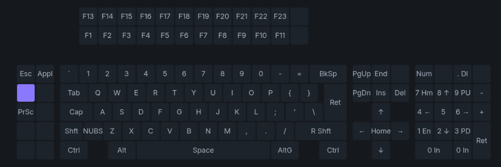
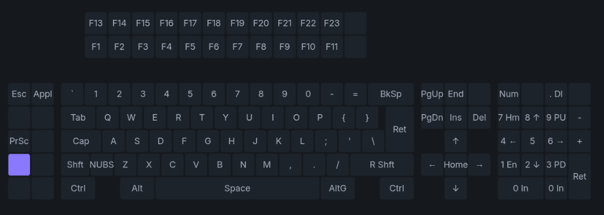

# m122_keyboard

Project for an IBM M122 keyboard controller

This is a project that replaces the original part from IBM with a nice modern solution.
It features a nRF52840 microcontroller and allows to use the keyboard
via USB connector, or via Bluetooth.

The firmware is based on the [ZMK](https://github.com/zmkfirmware) project.


## Parts

Beside the assembled PCB you require:

- A matching IBM Keyboard
- An external LiPO cell - the unit was designed with a LP103048JU 1.500 m Ah cell in mind
- One 8 pin connector for the flat flex coming from the keyboad 5-520315-8 from [AMP](doc/ENG_CD_520355_L2.pdf) DigiKey P/N 5-520315-8-ND
- One 20 pin connector for the flat flex coming from the keyboad 7-520355-0 from [AMP](doc/ENG_CD_520355_L2.pdf) DigiKey P/N A144436-ND

## Tools

You need a debug adapter (JLink) with 6 pin [Tag-Connect](https://www.tag-connect.com) for the initial flash programming of the board

## Order

When ordering the pcb from [JLC](https://jlcpcb.com) you need to specify

- Via Covering Epoxy Filled & Capped
- Min via hole size 0.2 mm

## Initial Setup

- Use the nrf-Flash-Tool to flash the bootloader to the nrf52840
- Use drag-and-drop of the uf2 build output to flash the keyboard firmware

## Build the Firmware

`push` and `pull_request` trigger a github-action to build the firmware. To locate the build output
go to the `Actions` tab and open the respective workflow run. There you find a link to the artifacts
generated by the run. You can download it and unpack the `.zip` archive to access the `.UF2` file.

This repository follows the versions of the ZMK project.
For details, please refer to the [Release Log](docs/releases.md).

## Update Firmware

To update the firmware activate the bootloader.
By default you can start the bootloader by hitting the `bootloader` key.

If successful, this will mount your keyboard as a USB mass storage device to your computer.
Now, you can install the firmware by simply drag and drop the UF2 file to the mounted device.

## Connect to ZMK Studio

To connect the keyboard to ZMK Studio open this [link](https://zmk.studio/).
Google's chrome is the preferred browser for this app.
Select the connection to your keyboard.
You need to press the `studio unlock` key on your keyboard to establish the connection.


## Bootloader

The project uses a modified [Adafruit](https://github.com/SvenHaedrich/Adafruit_nRF52_Bootloader.git) bootloader.

## Testing

You might want to test the basic electric functionality of the PCB. To do so, flash the firmware and connect the PCB to a computer´s USB port.
To view detailled event codes start

```bash
sudo evtest
```

Select your M122 controller as event source. Now, you can short individual rows and columns. Expected results are given for German keyboard layout.

| Row | Column | Keycode        |
|-----|--------|----------------|
|  1  |   16   | KEY_KP0        |
|  1  |    8   | KEY_B          |
|  2  |    8   | KEY_V          |
|  3  |   13   | KEY_RIGHTBRACE |
|  4  |    5   | KEY_Q          |
|  5  |    9   | KEY_6          |
|  6  |   12   | KEY_F5         |
|  7  |    1   | KEY_PPLUS      |
|  8  |   15   | KEY_APOSTROPHE |
|  2  |    2   | KEY_KP1        |
|  2  |    3   | KEY_CAPSLOCK   |
|  1  |    4   | KEY_LEFTSHIFT  |
|  1  |   20   | KEY_ENTER      |
|  1  |   19   | KEY_KPCOMMA    |
|  2  |   18   | KEY_KP2        |
|  2  |   17   | KEY_INSERT     |
|  4  |   15   | KEY_P          |
|  6  |   14   | KEY_9          |
|  4  |   11   | KEY_F7         |
|  3  |   10   | KEY_F20        |
|  7  |    6   | KEY_S          |
|  7  |    7   | KEY_D          |
